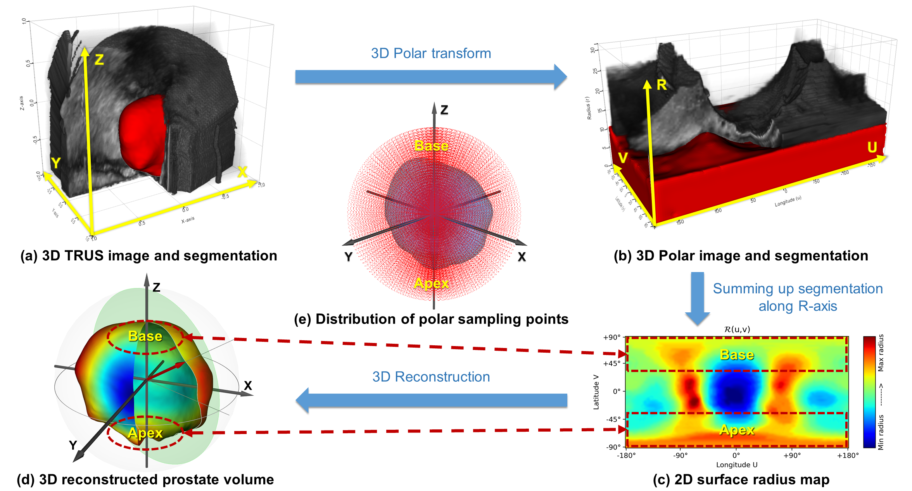
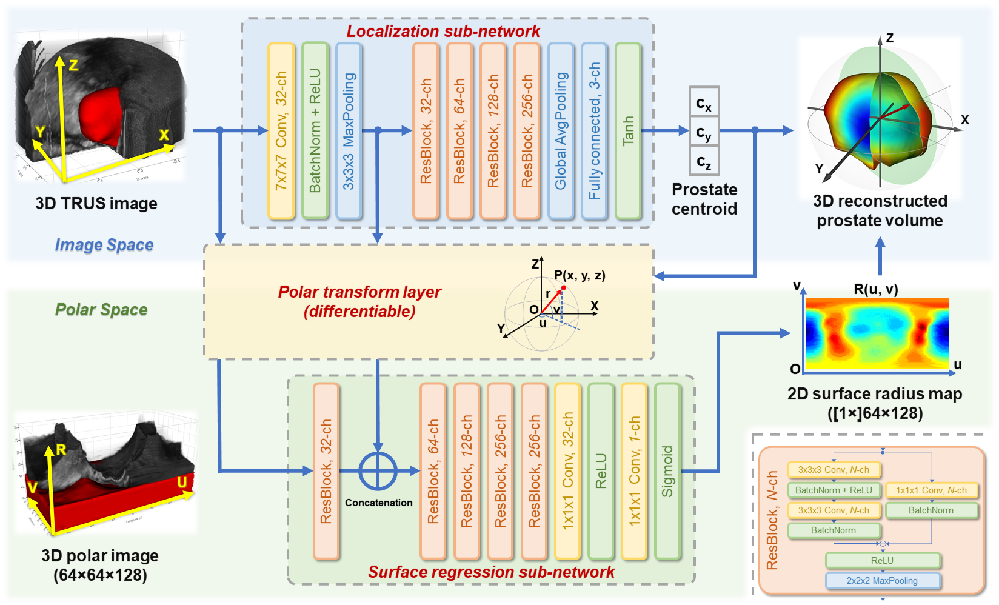

# Polar Transform Network (under construction)
Polar Transform Network for Prostate Ultrasound Segmentation with Uncertainty Estimation

This is a python (PyTorch) implementation of **Polar Transform Network (PTN)** method for prostate ultrasound segmentation proposed in our ***Medical Image Analysis*** journal paper [**"Polar Transform Network for Prostate Ultrasound Segmentation with Uncertainty Estimation"**](in press).

### Scheme of Polar Transformation for Prostate Ultrasound Segmentation

### Architecture of Polar Transform Network

## Citation
    @article{Xu2022PTN,
      title={Polar transform network for prostate ultrasound segmentation with uncertainty estimation}, 
      author={Xu, Xuanang and Sanford, Thomas and Turkbey, Baris and Xu, Sheng and Wood, Bradford J. and Yan, Pingkun},
      journal={Medical Image Analysis}, 
      year={2022}
    }
